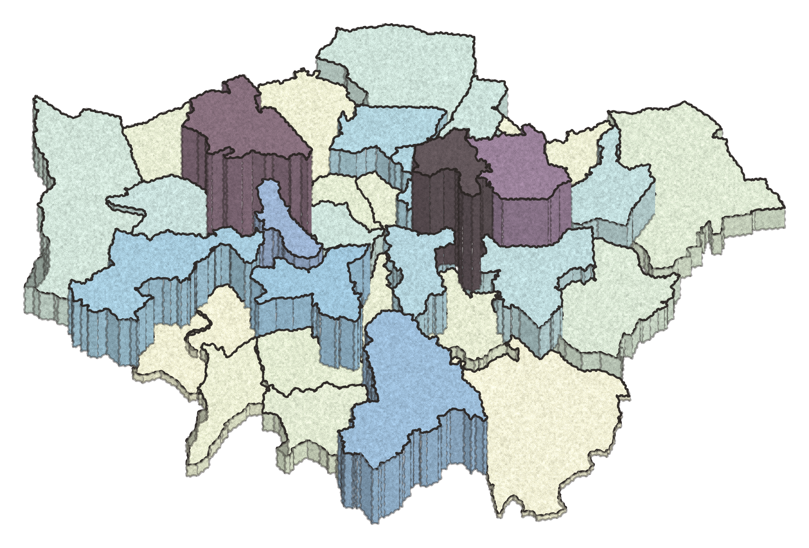

# Housing in London 2026 — cover art

An isometric 3D map of the 33 London boroughs. Each borough is extruded to a
height proportional to an input metric — by default **net additional dwellings**
(new homes added, 2021‑22) — and coloured with Paul Tol's *sunset* scheme.
Output is a PNG with a **transparent background**, ready to drop onto a cover.



## Run

```bash
python3 -m venv .venv && source .venv/bin/activate
pip install matplotlib shapely
python make_coverart.py            # -> housing_in_london_2026.png
```

## Files

| File | What it is |
|---|---|
| `make_coverart.py` | The renderer. All styling lives in the `CONFIG` block at the top. |
| `build_data.py` | Regenerates `data/borough_data.csv` from the raw series. |
| `data/borough_data.csv` | **The numbers that drive the picture** — one row per borough. Edit freely. |
| `data/net_additions_raw.csv` | Full 2001–2022 series (London Datastore, MHCLG Live Table 122). |
| `data/london_boroughs.geojson` | Borough boundaries (lon/lat), joined on `code`. |

## Changing what it shows

- **Different year:** `python build_data.py 2018-19` then `python make_coverart.py`.
- **Different metric:** put any numeric column in `data/borough_data.csv` (keyed
  by `code`) and set `VALUE_COLUMN` in `make_coverart.py`.
- **Look & feel:** `PALETTE` (`sunset` / `YlOrBr` / `iridescent` / `bright_seq`),
  `MAX_HEIGHT_KM`, camera `ELEV`/`AZIM`, lighting, DPI — all in `CONFIG`.
- **Render style:** `STYLE = "clean"` (crisp, smooth gradients) or `"sketch"`
  (hand-drawn / chalky / graphite — wobbly ink outlines + paper grain). Tune the
  sketch look with `SKETCH_WOBBLE`, `GRAIN_SIGMA`, `CHALK_DESAT`, `CHALK_LIGHTEN`.

## Data source

Net additional dwellings by borough, London Datastore dataset
[`net-additional-dwellings-borough`](https://data.london.gov.uk/dataset/net-additional-dwellings-borough/),
derived from MHCLG Live Table 122. Open Government Licence v2. Borough total for
2021‑22 (37,204) matches the published London control total.
